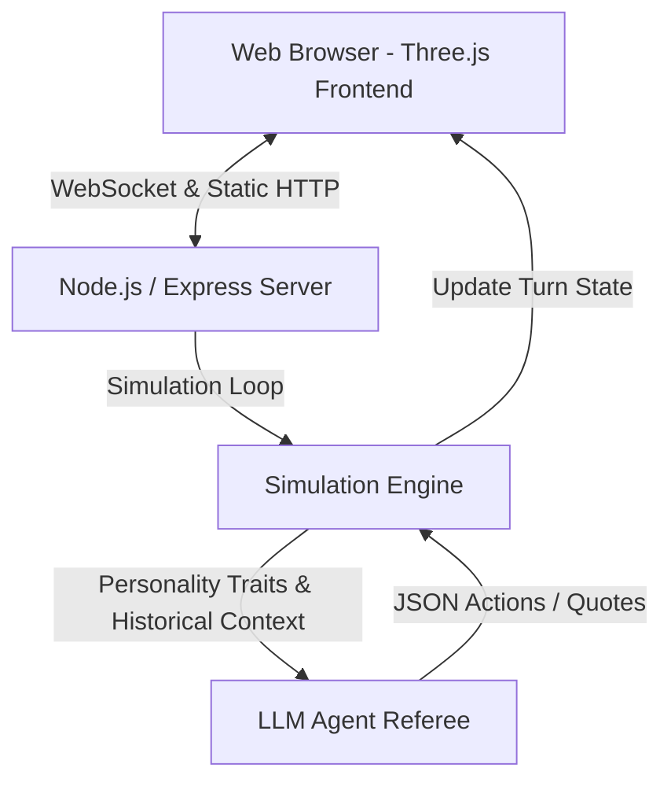

# 👑 TAM QUỐC LOẠN NHẬP (Three Kingdoms Warlords Sim)
> **Mô Phỏng Quân Chủ Xuyên Không 3D — Real-Time Multi-Agent Simulation**

[](https://threejs.org/)
[](https://nodejs.org/)
[](https://expressjs.com/)
[](https://creativecommons.org/publicdomain/zero/1.0/)

Dự án mô phỏng chiến thuật đa tác nhân (Multi-Agent Simulation) đưa **4 vị hoàng đế vĩ đại** trong lịch sử Trung Hoa xuyên không về thời kỳ Tam Quốc (~năm 200) để cạnh tranh quyền lực trực tiếp với **3 thế lực cát cứ bản địa** thông qua trí tuệ nhân tạo (LLM Agents).

Dự án sở hữu bản đồ chiến thuật 3D trực quan sử dụng **Three.js** theo phong cách **Civilization VI**, kết hợp cùng cơ chế mô phỏng tự động và hệ thống hội thoại cá tính mang đậm dấu ấn lịch sử của từng nhân vật.

---

## 🏛️ Đấu Trường Xuyên Không

| Cát Cứ / Quân Chủ | Triều Đại / Thế Lực | Màu Sắc | Đặc Điểm Tính Cách & Lối Chơi | Điểm Yếu Lịch Sử |
| :--- | :--- | :--- | :--- | :--- |
| **Tần Thủy Hoàng** (Doanh Chính) | **Nhà Tần** (Đế quốc) | 🖤 Vàng-Đen | Pháp trị tập quyền cực đoan, xây dựng công trình lớn, củng cố phòng thủ. | Tàn bạo, dễ làm mất lòng dân (`Dân tâm` giảm nhanh). |
| **Lý Thế Dân** (Đường Thái Tông) | **Nhà Đường** | 💙 Lam | Kỵ binh thiện chiến, trọng dụng hiền tài, ngoại giao xuất sắc. | Vướng mắc nội bộ gia tộc, tranh đoạt kế vị. |
| **Chu Nguyên Chương** (Minh Thái Tổ) | **Nhà Minh** | ❤️ Đỏ Thẫm | Khởi thân bần nông, chiến tranh du kích, kỷ luật thép, tích lương phòng thủ. | Đa nghi, dễ phát động thanh trừng nội bộ. |
| **Lưu Triệt** (Hán Vũ Đế) | **Nhà Hán** | 💜 Tím | Bành trướng quân sự viễn chinh, liên minh ngoại giao xa gần. | Tiêu hao quốc khố (`Lương thảo`), dễ sa đà mê tín cuối đời. |
| **Tào Tháo** (Tào Ngụy) | **Tam Quốc** (Ngụy) | 💚 Xanh Rêu | Gian hùng quyền biến, thích chiêu mộ hiền tài, hành động chớp nhoáng. | Đa nghi, dễ trúng mưu kế phản gián. |
| **Lưu Bị** (Thục Hán) | **Tam Quốc** (Thục) | 💚 Xanh Lá | Nhân nghĩa phục tâm, kiên nhẫn tích lũy địa bàn, phòng ngự vững chắc. | Lực lượng mỏng ban đầu, dễ bị cuốn vào phục thù cảm xúc. |
| **Tôn Quyền** (Đông Ngô) | **Tam Quốc** (Ngô) | 🧡 Cam | Thủy quân vượt trội, cố thủ giang sơn sông nước, liên minh linh hoạt. | Thiếu tính đột phá tiến công phương Bắc, thiên về thủ thành. |

---

## 🚀 Tính Năng Nổi Bật

### 🗺️ Bản Đồ Chiến Lược 3D (Style Civ-like)
* **Terrain Render:** Bản đồ 3D Three.js hiển thị sông ngòi, các tuyến đường bộ lịch sử, rừng cây (Kenney CC0 models) và các dãy núi trùng điệp dựng theo thuật toán từ dữ liệu `MOUNTAINS`.
* **Thành Trì & Quan Ải:** Các cứ điểm chiến lược (Thành Đô, Lạc Dương, Thục Đạo...) được dựng hình khối kiến trúc cổ (courtyard, tower, wall, gate) chân thực.
* **Tương Tác Camera:** Cho phép zoom in/out, xoay (orbit) và theo dõi trực quan các đơn vị di chuyển hoặc giao chiến.

### 🧠 LLM Multi-Agent Simulation
* **Quyết Định Tự Chủ:** Mỗi lượt, các quân chủ sẽ đưa ra quyết định hành động: **Tấn Công ⚔️**, **Ngoại Giao 🕊️**, **Nội Chính 🏛️**, **Mưu Kế 🎭**, hoặc **Củng Cố 🛡️**.
* **Độc Thoại Lịch Sử (Speech Bubbles):** Các Agent phát ngôn bằng những câu thoại đậm chất thần thái riêng khi đến lượt hành động của mình.
* **LLM Referee (Trọng Tài):** Đóng vai trò lịch sử phán quyết kết quả giao tranh dựa trên tương quan Binh lực, Lương thảo, Địa hình bản đồ và một chút yếu tố ngẫu nhiên để đảm bảo tính logic chân thực.

### 📊 Hệ Thống Chỉ Số & Visual Live Log
* **Thanh Chỉ Số Động:** Theo dõi trực tiếp 5 chỉ số cốt lõi: *Binh lực, Lương thảo, Lãnh thổ, Dân tâm, Uy tín*.
* **Bảng Xếp Hạng Uy Tín:** Tự động cập nhật thứ hạng các thế lực sau mỗi lượt.
* **Live Action Status:** Hiển thị bong bóng trạng thái nhấp nháy cho Agent ("Đang nghĩ...", "Đang tấn công...") cùng hiệu ứng nháy đỏ khi 2 thế lực lâm trận giao tranh.

---

## 🛠️ Kiến Trúc Hệ Thống



* **Frontend:** `index.html` duy nhất sử dụng Three.js (r128), Tailwind CSS (CDN), và Vanilla JavaScript.
* **Backend:** Node.js + Express (`scripts/server.js` và `scripts/simulation.js`) đảm nhận việc chạy simulation loop, phục vụ static files và xử lý logic kết quả.
* **Assets:** CC0 Assets quản lý qua `assets/manifest.json`.

---

## 📦 Hướng Dẫn Cài Đặt & Khởi Chạy

### Yêu Cầu Hệ Thống
* Node.js phiên bản 18 trở lên.
* Trình duyệt hỗ trợ WebGL (Chrome, Safari, Firefox).

### Các Bước Thực Hiện

1. **Cài đặt dependencies:**
   ```bash
   cd emperors
   npm install
   ```

2. **Chạy server phát triển (Development):**
   ```bash
   npm run dev
   ```
   *Server sẽ chạy tại địa chỉ: `http://localhost:3000`*

3. **Chạy server môi trường Production (Chạy nền):**
   ```bash
   npm start
   ```

---

## 📂 Cấu Trúc Thư Mục

```text
emperors/
├── assets/                  # Quản lý assets đồ họa 3D (Models, Textures)
│   ├── manifest.json        # Manifest khai báo toàn bộ asset sử dụng
│   ├── SOURCE.md            # Ghi nhận bản quyền các CC0 model/texture
│   ├── models/              # Mô hình 3D (nature, roads, citadels...)
│   └── textures/            # Các texture địa hình mặt đất, nước sông
├── personas/                # File cấu hình tính cách và hành vi của các quân chủ
├── scripts/
│   ├── server.js            # Khởi chạy Express Server & phục vụ WebSockets
│   ├── simulation.js        # Engine tính toán tiến trình lượt đấu & trạng thái game
│   └── shadow-qa.mjs        # Script tự động kiểm tra tích hợp tài nguyên
├── index.html               # Frontend chính (Scene Three.js, Camera & Dashboard UI)
├── package.json             # NPM project manifest
├── DESIGN-DOCUMENT.md       # Tài liệu thiết kế chi tiết gameplay & visual
├── HANDOFF.md               # Tài liệu bàn giao kỹ thuật & tiến độ
└── README.md                # Tài liệu hướng dẫn sử dụng dự án
```

---

## 🔍 Xác Minh & Kiểm Thử Hệ Thống

Dự án cung cấp một số lệnh kiểm thử nhanh tính hợp lệ của tài nguyên và mã nguồn:

* **Kiểm tra cú pháp JS trong index.html:**
  ```bash
  node --input-type=module - <<'NODE'
  const fs = await import('node:fs/promises');
  const html = await fs.readFile('index.html', 'utf8');
  const scripts = [...html.matchAll(/<script type="module">([\s\S]*?)<\/script>/g)].map(m => m[1]);
  await fs.writeFile('/tmp/emperors-index-check.mjs', scripts.join('\n'));
  NODE
  node --check /tmp/emperors-index-check.mjs
  ```

* **Xác minh các file tài nguyên đồ họa (assets) được khai báo:**
  ```bash
  node shadow-qa.mjs
  ```

---

## 📜 Giấy Phép & Bản Quyền Tài Nguyên
* Toàn bộ mã nguồn dự án được phát triển nội bộ.
* Các asset 3D (cây, đá, đường sá) được sử dụng từ các bộ tài nguyên miễn phí **CC0 (Kenney Nature Kit, Polygonal Mind)**. Vui lòng tham khảo chi tiết tại [assets/SOURCE.md](file:///Users/hoannt1/1-Projects/2.claw/emperors/assets/SOURCE.md).
