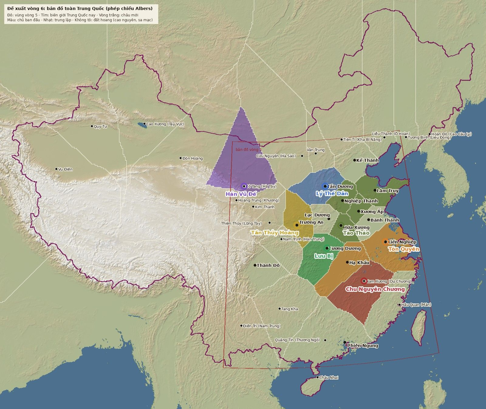

# Đề xuất vòng 6: bản đồ toàn Trung Quốc và lợi thế riêng của bốn hoàng đế

**Trạng thái:** chờ chủ dự án duyệt (2026-09-25). Chưa sửa luật, dữ liệu hay code theo đề xuất này.
Mọi con số dưới đây chỉ là ví dụ, phải đo lại bằng `npm run sim` trước khi đưa vào `data/world.json`.

## 1. Ý tưởng của chủ dự án

- Bản đồ phủ **toàn Trung Quốc ngày nay**, không chỉ quanh Trung Nguyên như Total War: Three Kingdoms (TW3K).
- Bốn hoàng đế xuyên không đến từ đời sau (hoặc đời trước, nhưng biết thế giới rộng hơn), nên hiểu địa lý hơn các nhân vật năm 200. Lợi thế của họ là **địa thế**.
- Tào Tháo, Lưu Bị, Tôn Quyền mạnh ở chỗ **quân đông, tập trung ở Trung Nguyên**.
- Mỗi hoàng đế cần một bộ lợi thế riêng.

## 2. Tra cứu làm nền

Chi tiết và nguồn nằm ở `docs/research/` (`tw3k.md`, `periphery.md`); phần dưới chỉ tóm tắt.

**TW3K:**
- Phần chơi được rộng khoảng 98,5–124°E × 18–42,5°N, xấp xỉ khung bản đồ vòng 5.
- Tây Tạng, Tân Cương, Mông Cổ, Triều Tiên chỉ là tranh vẽ làm phông; khoảng 47% đất vẽ trên bản đồ không chơi được.
- Lõi Trung Nguyên được phóng to khoảng 15–20%, vùng biên bị nén.
- Đường đi bị dồn qua đèo và núi không vượt được.
- Thu nhỏ hết cỡ thì chuyển sang một bức tranh thủy mặc phẳng.
- Toàn Trung Quốc lớn hơn khoảng 4,6 lần; TW3K chưa từng làm.

**Năm 200, vùng biên là một vành đai yếu, chia rẽ hoặc bị bỏ trống.** Trung Nguyên thì chật quân. Điều này khớp đúng câu chuyện của anh:
- Ordos (Hà Sáo) bị bỏ; Tào Tháo chính thức giải thể sáu quận biên năm 215.
- Hà Tây bị cắt rời thành Ung Châu riêng năm 194.
- Tây Vực không còn quan Hán từ năm 175.
- Liêu Đông là nước riêng của họ Công Tôn, có thủy quân.
- Tiên Ti chia hai (Kha Bỉ Năng, Bộ Độ Căn); Nam Hung Nô đã vào ở trong Tịnh Châu.
- Nam Trung do hào tộc địa phương giữ.
- Lĩnh Nam và Giao Chỉ là đất nhà Sĩ Nhiếp. Phiên Ngung năm 200 **chưa thuộc Tôn Quyền** (mãi khoảng năm 210 mới về tay Tôn Quyền).
- Sơn Việt chiếm vùng đồi đông nam; Hải Nam bị bỏ từ năm 46 TCN.

**Tần Thủy Hoàng và Hán Vũ Đế sống trước năm 200.** Họ không mang công nghệ tương lai. Lợi thế của họ là biết những con đường và công trình mà nhà Đông Hán đã bỏ: Trực Đạo, kênh Linh Cừ, kênh Trịnh Quốc, Ordos, Hà Tây, con đường tơ lụa, đồn điền biên giới, ngựa Đại Uyển.

**Đường Thái Tông và Minh Thái Tổ mang kiến thức thật của đời sau:**
- Lý Thế Dân: bàn đạp ngựa đôi (năm 200 chưa có) và kỵ binh nặng; mô hình "Thiên Khả Hãn" với dân du mục; tuyến Đại Vận Hà thời Tùy; biết Thổ Phồn sẽ trỗi dậy.
- Chu Nguyên Chương: hỏa khí, hỏa thuyền trên hồ (trận Bà Dương 1363), lúa Chiêm chín sớm, tường gạch nung, vệ sở (lính tự cày ruộng), đường dịch trạm qua Quý Châu vào Vân Nam.

## 3. Phạm vi và tỉ lệ bản đồ

- **Phạm vi:** lãnh thổ Trung Quốc ngày nay.
  - Giao Chỉ, Lạc Lãng, Đại Uyển (Ferghana) và Mạc Bắc là "cửa" ra ngoài bản đồ: có tên, có đường, không có đất chơi.
  - Cần anh xác nhận: có đưa Bắc Việt Nam và Bắc Triều Tiên (thế giới nhà Hán) vào không.
- **Phép chiếu:** Albers nón (vĩ tuyến chuẩn 25° và 47°, kinh tuyến giữa 105°E), phép chiếu chuẩn của bản đồ Trung Quốc. Phép chiếu phẳng hiện tại sẽ làm Tân Cương và Mãn Châu phình ra.
- **Tỉ lệ:** có ba cách.

| Cách | Mô tả | Được | Mất |
| --- | --- | --- | --- |
| A | Đúng tỉ lệ 3 km/ô trên toàn bộ (khoảng 2.200 × 1.450 ô) | Thật nhất, rộng nhất | Nặng; vùng biên rộng mà thưa sự kiện |
| B | Đúng tỉ lệ ở lõi Hán; nén 1,5–2,5 lần cao nguyên Tây Tạng, Tân Cương, Mông Cổ (khoảng 1.500 × 1.100 ô), giống cách TW3K bóp méo | Gọn, dễ nhìn | Ngược với ý anh "bản đồ bé hơn thực tế" và với `decisions/0006` |
| **C (đề xuất)** | Đúng tỉ lệ toàn bộ, nhưng mật độ chi tiết theo vùng (bên dưới) | Thật mà vẫn nhẹ | Vùng biên ít chi tiết hơn lõi |

Chi tiết theo vùng của cách C:
- **Lõi Hán:** chi tiết như vòng 5.
- **Vùng biên:** lưới thưa hơn, ít làng; mỗi châu biên rất rộng.
- **Cao nguyên Tây Tạng, Taklamakan, rừng bắc Mãn Châu:** đất hoang. Chỉ đi được qua vài hành lang (đèo, ốc đảo), như cách TW3K dồn đường.
- **Thu nhỏ hết cỡ:** chuyển sang một bản đồ tranh vẽ phẳng. Không vẽ 3D cả nước, vừa nhẹ vừa hợp chất thủy mặc.

*Ảnh dựng từ AWS Terrain Tiles (độ cao) và Natural Earth (biên giới), phép chiếu Albers. Châu chia tạm theo chi phí đi lại, chỉ để minh hoạ.*

## 4. Châu

Từ 14 châu tăng lên khoảng 30–35 châu: 14 châu cũ, cộng khoảng 19 châu biên. Chủ năm 200 của các châu biên:

| Vùng | Châu đề xuất (thủ phủ) | Chủ năm 200 |
| --- | --- | --- |
| Đông Bắc | Liêu Đông (Tương Bình), Liêu Tây (Liễu Thành), Cao Câu Ly (Hoàn Đô) | Công Tôn Độ, Ô Hoàn, Cao Câu Ly |
| Thảo nguyên | Tiên Ti (Kha Bỉ Năng), Vân Trung, Hà Sáo (Cửu Nguyên) | Tiên Ti; Hà Sáo gần như bỏ trống |
| Tây Bắc | Lũng Tây (Thiên Thủy), Kim Thành, Hà Tây (Cô Tang), Đôn Hoàng, Hoàng Trung | Mã Đằng, Hàn Toại, hào tộc Hà Tây, người Khương |
| Tây Vực | Cao Xương, Quy Tư, Vu Điền (có thể gộp thành 1–2 châu) | Các thành bang ốc đảo |
| Tây Nam | Hán Trung (Nam Trịnh), Nam Trung (Điền Trì), Tang Kha | Trương Lỗ, hào tộc Nam Trung, bộ lạc |
| Nam, Đông Nam | Dự Chương (Nam Xương), Mân (Hầu Quan), Thương Ngô (Quảng Tín), Hải Nam (Châu Nhai) | Tôn Bôn (theo Tôn Sách) [cần kiểm], Sơn Việt, nhà Sĩ Nhiếp |

**Đất hoang:** cao nguyên Tây Tạng, Taklamakan, rừng Mãn Châu phía bắc, Đài Loan. Có thể vào nhưng mất quân (hao quân vì địa hình, bệnh).

## 5. Nơi xuất phát

Ba quân phiệt giữ Trung Nguyên như cũ. Bốn hoàng đế đứng ở bốn phía, mỗi người cạnh một vùng biên yếu mà chỉ họ biết cách khai thác.

| Hoàng đế | Hiện tại | Đề xuất | Vì sao |
| --- | --- | --- | --- |
| Tần Thủy Hoàng | Trường An | **Giữ Quan Trung**, thêm châu Hà Sáo trống ở phía bắc | Đất gốc nhà Tần, bốn cửa ải. Trực Đạo nối Quan Trung với Hà Sáo, có chỗ lớn lên mà không phải đâm ngay vào Tào Tháo ở Đồng Quan |
| Hán Vũ Đế | Thành Đô | **Hà Tây (Cô Tang/Vũ Uy)** | Chính ông lập bốn quận Hà Tây; cửa ngõ con đường tơ lụa. Thành Đô trả về Lưu Chương (đúng lịch sử) |
| Lý Thế Dân | Tấn Dương | **Giữ Tấn Dương**, mở các châu thảo nguyên phía bắc | Tấn Dương là nơi nhà Đường khởi binh năm 617. Láng giềng là dân du mục, hợp với "Thiên Khả Hãn" |
| Chu Nguyên Chương | Bành Thành | **Dự Chương (hồ Bà Dương)**, hoặc Hoài Nam (quê ông) | Hồ Bà Dương là nơi ông thắng trận quyết định năm 1363; vựa lúa. Lấy bớt đất lúa của Tôn Quyền (phe AI mạnh nhất hiện nay) |

Sửa theo lịch sử: Phiên Ngung (Lĩnh Nam) bắt đầu là **trung lập** (nhà Sĩ Nhiếp), không thuộc Tôn Quyền.

## 6. Lợi thế riêng

Mỗi hoàng đế có ba lợi thế, gắn với một vùng trên bản đồ để bản đồ lớn thật sự có ý nghĩa:

| Hoàng đế | Lợi thế | Cơ chế (lời thường) | Căn cứ lịch sử |
| --- | --- | --- | --- |
| **Tần Thủy Hoàng** · "Xa đồng quỹ" | Trực Đạo | Công trình nhiều lượt ở Quan Trung, mở đường Quan Trung ↔ Hà Sáo. Các châu nối bằng đường Tần giữ quân chung khi bị đánh | Trực Đạo 700 km làm trong 2 năm |
| | Linh Cừ | Khi có châu ở nam Kinh Châu: mở đường sông xuống Lĩnh Nam; quân của ông không hao vì chướng khí và đèo Ngũ Lĩnh | Linh Cừ năm 214 TCN |
| | Thư đồng văn | Châu mới chiếm cho thu nhập đầy đủ ngay; thủ phủ thêm một cấp thành (bốn cửa ải). Đổi lại, dân tâm vẫn tụt như hiện nay | Thống nhất chữ viết, đo lường |
| **Hán Vũ Đế** · "Tạc không Tây Vực" | Con đường tơ lụa | Mỗi châu buôn bán trên chuỗi Đôn Hoàng – Hà Tây – Quan Trung cho thêm lương; chuỗi liền mạch tới Trung Nguyên thì nhân lên | Bốn quận Hà Tây, Ngọc Môn quan |
| | Thiên mã | Liên hôn với Ô Tôn hoặc giữ cửa Đại Uyển: được kỵ binh mạnh và một đợt ngựa | Ngựa Đại Uyển, công chúa Tế Quân |
| | Đồn điền | Quân đóng ở châu biên không tốn lương; không hao quân ở sa mạc Hà Tây – Tây Vực | Đồn điền Luân Đài |
| **Lý Thế Dân** · "Thiên Khả Hãn" | Thiên Khả Hãn | Ngoại giao với dân du mục (Tiên Ti, Nam Hung Nô, Ô Hoàn, Khương) gần như chắc thành nếu vừa thắng trận gần đó. Châu du mục thành chư hầu ki mi: không cần giữ quân, mỗi năm nộp kỵ binh | Năm 630 được tôn Thiên Khả Hãn; phủ ki mi |
| | Huyền Giáp kỵ | Kỵ binh mạnh hơn trên đồng bằng và thảo nguyên; thỉnh thoảng có đòn "Hổ Lao": đánh bên thủ đã mệt thì nhân lớn. Là khoảnh khắc đẹp cho clip | Bàn đạp đôi; trận Hổ Lao 621 |
| | Phủ binh | Tuyển quân rẻ, nuôi quân rẻ ở châu có ngựa, đồng cỏ | Chế độ phủ binh |
| **Chu Nguyên Chương** · "Cao trúc tường, quảng tích lương" | Thủy chiến Bà Dương | Đánh trên sông, hồ được thêm sức, xoá lợi thế thủy quân của Tôn Quyền; mỗi cuộc chiến có một đòn hỏa thuyền | Trận hồ Bà Dương 1363 |
| | Hỏa khí | Công thành bỏ qua 1–2 cấp tường; trận đầu với mỗi phe làm đối phương hoảng. Vẫn giữ luật "1.000 quân không hạ được thành 10.000 quân" vì đây là hệ số, không phải thắng chắc | Hỏa khí đầu Minh |
| | Lúa Chiêm và vệ sở | Châu lúa phía nam thu hoạch nhiều hơn; quân tự nuôi một phần; thủ phủ có tường gạch (trên bản đồ 3D thấy rõ gạch thay vì đất nện) | Lúa Chiêm, vệ sở, tường Nam Kinh |

**Giữ thế cho ba quân phiệt:**
- **Tào Tháo:** biến cố "Bạch Lang Sơn". Giữ U Châu và thắng Ô Hoàn thì được kỵ binh Ô Hoàn (như năm 207). Đồng Quan là cửa ải mạnh của ông.
- **Tôn Quyền:** mất Phiên Ngung lúc đầu. Giữ lợi thế thủy quân. Thêm "chiêu mộ Sơn Việt" (thêm lính sau khi đánh Sơn Việt) và một biến cố "vượt biển" nhiều rủi ro.
- **Lưu Bị:** ngoại giao với Vũ Lăng Man và Nam Trung.

## 7. Thay đổi luật và engine (sau khi duyệt)

- `data/world.json`:
  - châu có thẻ tài nguyên (ngựa, sắt, muối, ngọc, tơ lụa, lúa, buôn bán);
  - thẻ hiểm địa (chướng khí, sa mạc, cao nguyên, đầm lầy);
  - cờ châu biên.
- Láng giềng thành **cạnh có loại**: đèo, sông, biển, đường, sa mạc. Có **cạnh ẩn** chỉ phe biết mới dùng được, ví dụ đường Lư Long mà Tào Tháo đi năm 207.
- **Công trình nhiều lượt:** một dạng Nội chính kéo dài vài lượt, xong thì mở cạnh mới hoặc thêm thu nhập. Trên bản đồ 3D có giàn giáo và thanh tiến độ.
- **Hao quân** khi vào vùng hiểm địa, trừ phe bản địa hoặc phe có kiến thức.
- **Ngoại tộc trung lập:** ngoại giao với họ có thể ra "kỵ binh đến giúp" thay vì chỉ chiêu hàng đất.
- **Luật thống nhất:** với khoảng 30 châu thì mốc hiện tại quá thấp. Đề xuất: giữ đủ N trong 13 châu Hán cộng M châu bất kỳ, hoặc châu biên tính nửa điểm.
- Đổi `src/engine/engine.js`, `tests/engine.test.mjs`, `docs/product/rules.md` trong cùng một commit. Đo cân bằng bằng `npm run sim -- 500`.

## 8. Kỹ thuật bản đồ

- Nướng sẵn cả mặt nạ (rừng, ruộng, đường, biên châu, bóng núi) trong `tools/bake-map.mjs`, không tính lúc mở trang nữa. Ở quy mô toàn quốc, tính lúc mở trang sẽ mất gần một phút.
- Chia bản đồ thành ô. Lúc mở trang chỉ tải lưới thô cả nước; lưới mịn và mặt nạ của từng ô tải dần quanh camera.
- Mật độ theo vùng như cách C. Thành mới ở vùng biên dựng theo kiểu riêng:
  - đồn và thành đất Hà Tây;
  - thành ốc đảo Tây Vực;
  - trại lều du mục;
  - thành núi Cao Câu Ly.
- Học từ mã dat.city: xem mục 9.

## 9. Học từ dat.city

Đã đọc toàn bộ mã của dat.city (`docs/research/datcity.md`). Những điều nên làm theo, xếp theo thứ tự ưu tiên:

1. **Gộp theo khối hình:** thành, làng, quân dựng từ 10–20 khối dùng chung (tường, cổng, mái, tháp…). Mỗi khối là một InstancedMesh có màu riêng từng bản sao. Làm vậy thì giữ được chi tiết ở mọi thành mà vẫn ít lệnh vẽ.
2. **Chi tiết đưa vào shader:** ngói, lớp đất nện, AO ở chân tường, đèn lồng ban đêm.
3. **Bốn mức chất lượng, tự hạ mức** khi máy chậm. Điện thoại mặc định mức vừa.
4. **Dựng dần theo từng khung,** tối đa khoảng 5 ms mỗi khung, vùng gần camera trước. Trang không bao giờ đứng hình.
5. **Hiện dần theo tiến độ dựng:** vòng hiện hoặc sương chiến tranh lan ra.
6. **Bóng chỉ quanh tiêu điểm,** vẽ lại cách một khung; ở góc toàn cảnh thì tắt bóng.
7. **DOF theo độ zoom:** toàn cảnh nét, cận cảnh mềm.
8. **Camera kiểu ống kính dài** (FOV khoảng 25°): góc nghiêng thay đổi theo độ xa; có bay tới, xoay chậm khi rảnh, bám theo đạo quân. Hợp để quay clip.
9. **Sương theo khoảng cách camera,** bầu trời đi theo camera, **chu kỳ ngày đêm** theo bảng khoá. Một lượt có thể ứng với một thời điểm trong ngày.
10. **Nước dùng một shader duy nhất,** đọc mặt nạ khoảng cách tới bờ vẽ sẵn.

## 10. Thứ tự làm nếu được duyệt

1. Chốt với anh: phạm vi (có Bắc Việt, Bắc Triều Tiên không), cách tỉ lệ (A/B/C), danh sách châu, nơi xuất phát, bộ lợi thế.
2. Luật và dữ liệu: engine, test, `rules.md`, `world.json` v2. Đo cân bằng bằng sim cho tới khi bảy phe đều có cơ hội thắng.
3. Bake toàn quốc theo phép chiếu Albers, có ô và mặt nạ nướng sẵn; bản đồ tranh cho chế độ thu nhỏ.
4. Thành và trại vùng biên; render lại các góc máy; đưa lên canvas duyệt.

## 11. Cần anh quyết

1. Phạm vi: đúng biên giới Trung Quốc ngày nay, hay theo thế giới nhà Hán (có Bắc Việt Nam, Bắc Triều Tiên)?
2. Tỉ lệ: A, B hay C (em đề xuất C)?
3. Nơi xuất phát: đưa hẳn các hoàng đế ra vùng biên như bảng ở mục 5, hay giữ gần lõi?
4. Tần Thủy Hoàng và Hán Vũ Đế: chỉ có lợi thế "đường cũ, công trình cũ" (đúng lịch sử), hay cho thêm công nghệ đời sau?
5. Bốn chỗ kịch bản lệch lịch sử (`docs/design/history.md`): Kiến Nghiệp, Trường An, Hạ Khẩu, Nghiệp Thành.
